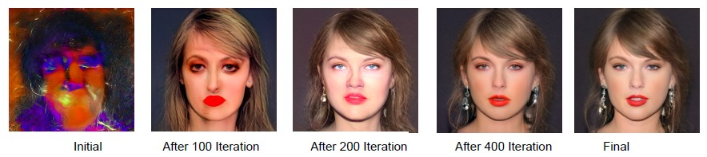
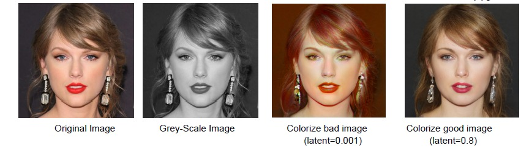
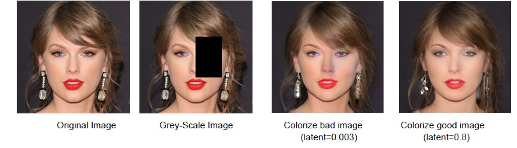

# GAN-Image-Inversion
Inverting images using a Generative Adversarial Network (GAN)
GAN Image Inversion with Degradation
This repository contains code for inverting images using a Generative Adversarial Network (GAN), specifically focusing on applying different degradation techniques during the inversion process.

## Usage
The main function to run is 'invert_image(degradation_mode)', where degradation_mode can be one of the following constants:

- GAUSSIAN_BLUR_DEGRADATION
- GRAYSCALE_DEGRADATION
- INPAINTING_DEGRADATION

Ensure you have the target image saved in your Google Drive or specify the path accordingly.

## Results
* Inversion proccess:
  

The code generates various intermediate results during the inversion process, including degraded images, optimized latent vectors, and final inverted images. 
The 'latent_dist_reg_weight' variable controls the regularization strength applied to the distance between the optimized latent vector and the average latent vector. 
This regularization term aims to ensure that the optimized latent vector stays close to the average latent vector during the optimization process.

Therefore, adjusting the latent_dist_reg_weight parameter can significantly impact the final output of the image inversion process, providing a way to control the trade-off between regularization and optimization freedom:
* Different outputs of inversion for colorization degarded image for different latent_dist_reg_weight parameters:
  
* Different outputs of inversion for colorization degarded image for different latent_dist_reg_weight parameters:
  
  
## Degradation Techniques
- Gaussian Blur Degradation: Simulates image blurring using a Gaussian blur filter.
- Grayscale Degradation: Converts RGB images to grayscale.
- Inpainting Degradation: Applies an inpainting mask to the image, simulating areas that need restoration.

## Dependencies
- Python 3.x
- PyTorch
- NumPy
- Matplotlib
- Torchvision
- DNNLib
- MediaPy
- Click
- Imageio
- Pillow
- SciPy
- Contributing
- Contributions are welcome! Feel free to suggest improvements, report issues, or submit pull requests.

## License
This project is licensed under the MIT License - see the LICENSE file for details.
